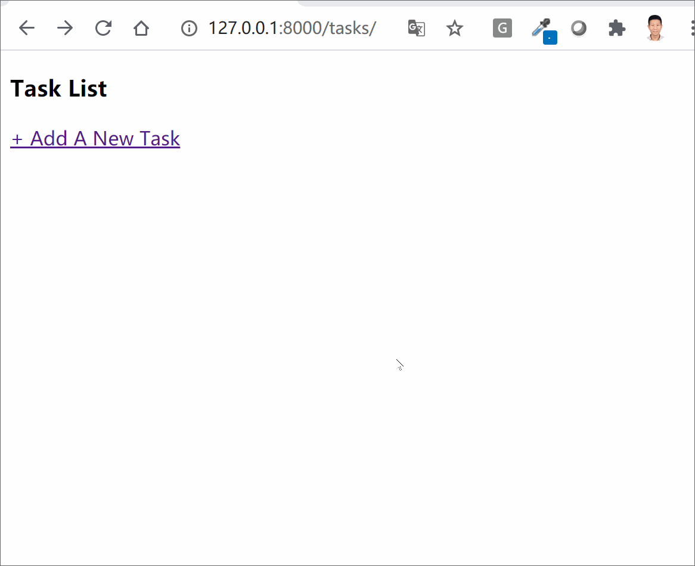

# A Simple Example of Django CRUD (Create, Retrieve, Update and Delete) Application Using Functional Based Views

We will use Django and functional based views to develop a simple application to allow one to create a new task, retrieve task list or a single task, update a task and delete a task. 

### Demo

If you cannot see the animated gif below, please download task_crud.gif and open it in our browser. 

